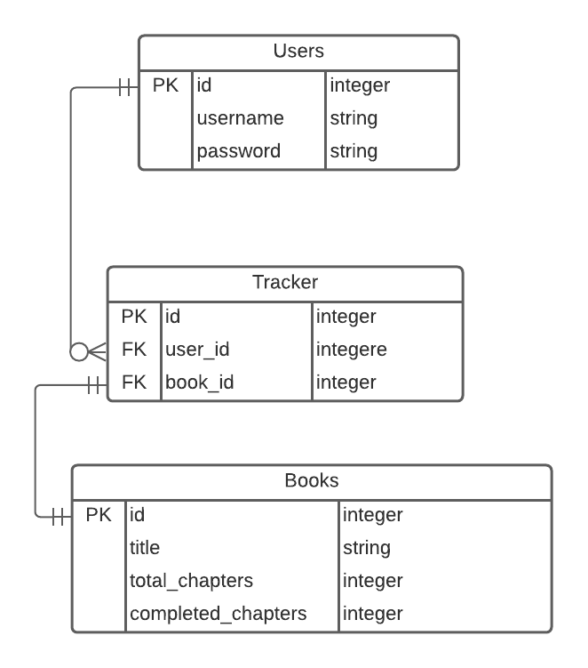

# Track Books API

> Track books is a full-stack application that lets users track the books they're reading. This repo hosts the code for the backend of the application. To view the code for the backend, go to [Track Books (frontend)](https://github.com/meronokbay/track-books/).


- A user can signup and login.
- Logged in user can add books with title, total chapters and completed chapters as parameters.
- Logged in user can track books and increase the completed chapters.
- Logged in user can view the progress of each book in a circular progress bar.

### ERD



## Built With

- Rails
- RSpec
- PostgreSQL
- Insomnia (to generate the docs)

## API Endpoint

```
https://track-books.herokuapp.com/api/v1
```

## Documentation

```
https://meronokbay.github.io/track-books-api/
```

## Getting Started

To get a local copy up and running follow these simple example steps.

### Prerequisites

- Ruby 3.0.0
- Rails 6.1.3
- PostgreSQL

### Setup

Clone the repo

```
git clone https://github.com/meronokbay/track-books-api/
```

### Install

`cd` into the cloned repo and execute `bundle install`.

### Usage

Execute `rails s` to spin up a local server.

### Run tests

Execute `bundle exec rspec` to run the unit and request tests.

## Author

👤 **Meron Ogbai**

- Github: [@meronokbay](https://github.com/meronokbay)
- Twitter: [@MeronDev](https://twitter.com/MeronDev)
- Linkedin: [Meron Ogbai](https://linkedin.com/in/meron-ogbai/)

## 🤝 Contributing

Contributions, issues, and feature requests are welcome!

## Show your support

Give a ⭐️ if you like this project!

## 📝 License

This project is [MIT](./LICENSE) licensed.
